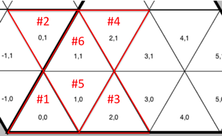
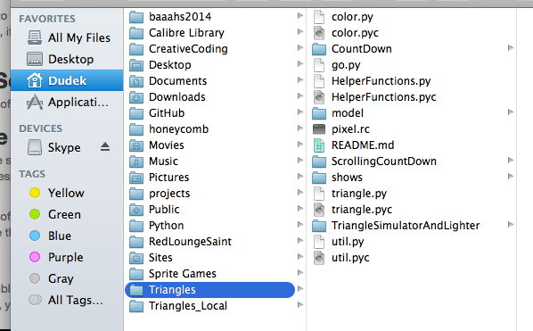
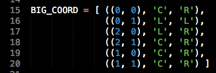
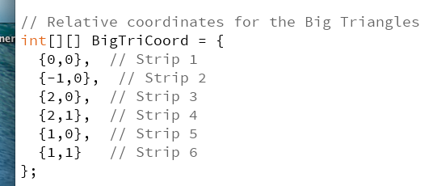
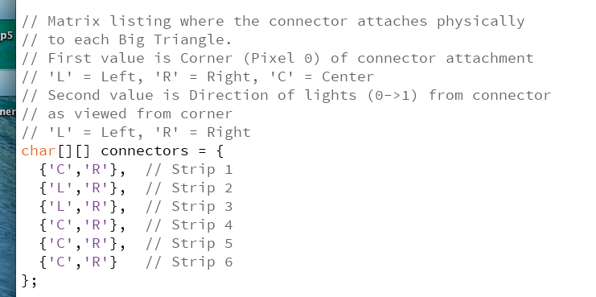
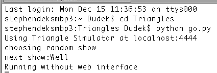
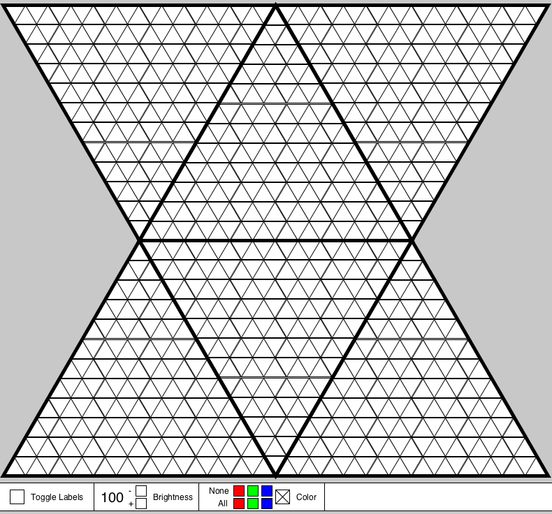
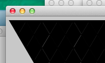

# Triangles Documentation

December 15, 2014
 

## Sections

* #### Triangle Installation
* #### Hardware Connections
* #### Starting the Software
* #### Configuring the Triangles
* #### Running the Software
* #### Show Controls
* #### New Year's Eve event
* #### Technical Notes

## Triangles Installation

For each Triangle, the orientation of the one connecting wire (i.e. which corner) does not matter. Also does not matter which side of the Triangle faces front.

It is easiest to position the corner with the connecting wire closest to the Pixel Pusher to use the least amount of wire. For best viewing, hang all Triangles with the LEDs all pointing as close to up as possible.

I prefer to suspend the Triangles with rope tied securely looped around the corner hinges. If you are hanging a Triangle over a crowd, suspend from at least two corners as a wood rail could tear off from a hinge. For the hourglass shapes, I suggest hanging the top Triangle from its two top corner, and the lower Triangle connected from corners with two side ropes.

If you screw eye-bolts into the wood rails, pre-drill the hole (really), or you will split the wood.

Don't unloop the connection wire from the Triangle corner. The wire is looped once to relieve strain and prevent tearing the electronic connection.

## Hardware Connections

### Triangles

Connect block-terminal extender cables as needed to wire the Triangles to a centralized spot where the following lives together: Pixel Pusher, power supply, router, and laptop.

The extender cables have male and female ends much like extension cords. I left at Gray Area a bag of extender cables, but after these are gone, there are no more easily-available extender cables, unless John Major makes an emergency trip to NIMBY in Oakland. Use the extender cables wisely!

Plug the cables into the Pixel Pusher ports. When disconnecting a cable from the Pusher, disconnect it at the block junction and not at the Pusher. The pins on the Pusher are fragile, and if we mush them, we're screwed.

### Pixel Pusher

The Pusher has 7 connectors already seated: 6 you need and 1 extra. You can read the strip numbers in white letters on the Pusher, like "Strip 1."

I set up the 6 Triangles in this configuration to make 2 hourglasses and a middle diamond. I suggest hanging that middle diamond sideways over the middle of the dance floor.

You can change completely and easily this configuration if you don't like hourglasses to prefer pyramids, rows, or triforce geometries. See the section called "Configuring the Triangles"

Connect an ethernet cable between the Pixel Pusher and the router. Likely doesn't matter which router port, but I have been using port 3.

Insert the USB stick into the Pixel Pusher

### USB Stick

The USB Stick needs a text file on it named pixel.rc . There are copies of this text file on the USB stick, my laptop, the github repository, and at the end of this document.

### Router

Plug the router into a power strip with the included wallwart adapter.

### Computer

Plug the computer's power into that power strip.

Connect a 2nd ethernet cable from the computer to the router. I have been using port 1.

### Power Supply

Connect the silver 40A power supply directly to the wall (through extension cords) and not to a power strip, as the surge protector may trip with 40A. A green light should come on in the power supply.

Plug the power supply into the Pixel Pusher. The USB stick should light up, if it has an indicator light.

## Starting the Software

Boot up a text editor, like Sublime Text. Boot up Processing.

Open "triangle.py" in the text editor and "TriangleSimulatorAndLighter.pde" in Processing.

These are the two files you need to run the Triangles. All the files live in a folder called Triangle. The file structure on my laptop looks like:

## Configure the Triangles

Tell the software how each Triangle is oriented with respect to its coordinate and connector wire.

#### triangle.py

From a text editor, like Sublime Text, open the triangle.py file. At the top, you'll see an array like this:

Don't change the coordinates, like (0,0), if you are keeping the hourglass format. Do you see how the coordinates match those in the picture above? Do update the letters, like 'C', 'R', using the guidelines below for Connector. Save the changes.

#### TriangleSimulatorAndLighter.pde

Boot up Processing. Open the TriangleSimulatorAndLighter. At the top of the sketch, you'll see the same kind of array as in triangle.py. What is different is that there are two arrays, one for the coordinates:

and a second array for the connectors:

Update the values like you did for triangle.py and save the changes.

**Down the same array update for the ScrollingCountDown.pde!**

### Coordinate

The Triangles tile on a grid, like in the picture above. If you change the display of the Triangles, change their (x,y) coordinates. These coordinates are relative so it doesn't matter where you start, although for simplicity, make the first coordinate close to (0,0).

The x value is column number and the y value is row number, as in regular grid coordinates.

More than one Triangle can use the same (x,y) coordinate if you want them to have the same pattern. For example, if you want all 6 Triangles to look the same, set them all to (0,0). Do check that this works and doesn't crash the software!

### Connector

Each connector has two letters, a corner and a direction.

#### Corner

Look at the installed Triangle and note whether the wire comes in to the left ('L'), center ('C'), or ('R') corner. It doesn't matter whether the Triangle is hung point up or point down. All caps!

#### Direction

If you stare at the sharp corner where the wire comes in, do the lights from the connector run to the left ('L') or right ('R')? All caps!

### Checking

When you run the simulator (next), do the Triangles light up like they do on the screen? If they don't, you misread the connections.

## Running the Software

In Processing, press the triangle arrow to start the TriangleSimulatorAndLighter. It should boot java to present the Triangle simulator (see picture in Show Controls section).

Open a terminal. Switch to the Triangle directory. For me, this means first typing:

	$ cd Triangle

Type:

	$ python go.py

The simulator should display the display the current show. The Triangles should light up. Check the Triangle lights against the Simulator to see whether you read the connections correctly.

## Show Controls

**I don't know the stability of adjusting the Show Controller. If Processing shuts down, the Triangles stop working. Adjust the Show Controls sparingly (or go for broke). Likewise, there be disaster if a beer gets spilled on the laptop.**

You can change the lighting in the following ways:

### Toggle Labels

Click the empty box to toggle the display on the Simulator for (x,y) coordinates and (strip, pixel) coordinates, useful if you forget how the coordinate system works or where each Big Triangle lives.

### Brightness

That bold 100 is % Brightness. You can dial down the brightness to 10%. Background pixels take longer to refresh brightness so brightness changes may not be immediately apparent for all pixels.

### Color

Only one of the 7 boxes can be checked at a time. Checking the large white box means no color correction. Color correction is useful to warm the display into reds and yellows. Try color correction before show time so you know what you are getting into.

##### None

Exclude this color from the palette.

##### All

Always present this color.

### Shows

Shows are picked randomly and run for 3 minutes (180 seconds). If you want longer or shorter shows, change beforehand the default in go.py, line 223:

	parser.add_argument('--max-time', type=float, default=float(180),
		help='Maximum number of seconds a show will run (default 180)')

### Screen Shot of the Simulator

## New Year's Eve event

### Run only the Sparkles show until midnight

From the terminal, set up Sparkles to run for 13 hours by typing:

	python go.py Sparkles --max-time=50000

### Just before midnight

In Processing, open but don't run this sketch:

	ScrollingCountDown.pde
	
### At Midnight

One minute before minute, stop the Sparkles show from the terminal with:

	ctrl-C

Immediately close the Simulator screenshot by clicking the red button:

Start the ScrollingCountDown.pde by clicking the go arrow on the Processing sketch.

Click the Start/Stop box at exactly 20 seconds to midnight.

### Just after midnight

After the countdown finishes, close the ScrollingCountDown simulator by clicking its red button. Restart the regular TrianglesSimulatorAndLighter by clicking its go arrow. On the terminal, run all shows with:

	python go.py
	
## Technical Notes

### Contact infomation

##### Stephen Dudek
781-223-8626
stevedudek@gmail.com

##### John Major
617-270-7981
iamh2o@gmail.com

### Where files live. Many copies.

##### On Stephen Dudek's laptop in the Dudek/Triangle directory

##### On github in a Triangles repository for Stephen Dudek:

https://github.com/stevedudek/Triangles.git

##### On the Pixel Pusher USB stick

##### On John Major's laptop

### Pixel Pusher

Don't wreck the Pixel Pusher!

There are two Pixel Pusher boxes named Phillip and Hex. Use the Hex box. I could not successfully configure the firmware on the Phillip box. See Greg Brown for proper configuration, as he configured the Hex box.

### Hardware

I left a stapler and staples at Gray Area for Triangle repair.

Don't bother fixing individual LEDs.

If you wreck a Triangle's electronics well before NYE, see whether Tom Landers will attempt a solder repair. Otherwise, take the Triangle out of commission.

### pixel.rc text file

This the one file that needs to be on the Pixel Pusher's USB stick. Copies of this file are every place the software lives (see Where files lives). Ignore the text rendering below. Copy and past from the following line:

# Configuration file for PixelPusher with two inch pixels

# You can change this if you have longer or shorter strings.
pixels=144
swap=123456

# This sets how many strings are attached.
stripsattached=6

artnet_universe=1
artnet_channel=1

strip1=ws2801
order1=grb
strip2=ws2801
order2=grb
strip3=ws2801
order3=grb
strip4=ws2801
order4=grb
strip5=ws2801
order5=grb
strip6=ws2801
order6=grb

ether=10.1.0.20
netmask=255.255.255.0
gateway=10.1.0.1